# 2025年十五大最佳汽车托运服务平台(最新更新)

搬家换州工作、在外地买了心仪的二手车、退役要把爱车运回老家、冬天开去佛罗里达过冬——需要跨州运车的场景太多了,但自己开几千公里既累又费油,还得担心路上磨损。专业的汽车托运服务能帮你省时省心,车子直接从A点送到B点,你只管在目的地等着签收就行。这份榜单精选了15家靠谱的汽车托运公司,涵盖开放式运输、封闭式运输、摩托车托运、夏威夷跨海运输等各种需求,帮你找到价格合理、服务靠谱、适合自己路线的那一家。

## **[Montway Auto Transport](https://www.montway.com)**

全美唯一提供30天价格保证的汽车托运公司。

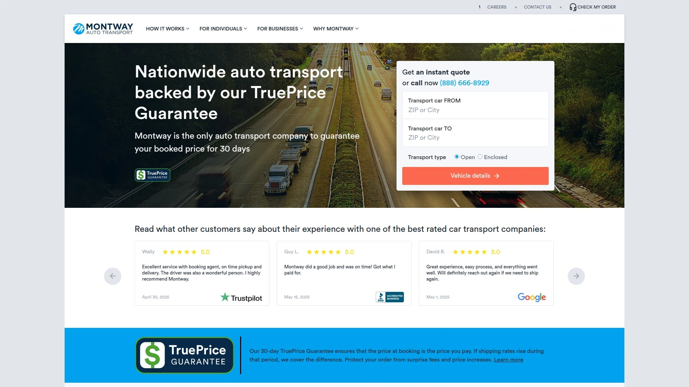

Montway成立于2007年,总部位于伊利诺伊州绍姆堡,是美国顶尖的汽车托运经纪公司之一,每年安排超过25万辆车的运输。他们家最大的卖点是TruePrice真实价格保证:订单确认后30天内价格锁定不变,完全不用担心临近发车涨价。服务覆盖全美50个州,开放式和封闭式运输都有,门到门服务是标配。网站提供即时报价计算器,不需要留电话就能看到价格区间,对比其他家方便很多。他们家跟超过3万名专业司机建立了稳定网络,BBB评级A+,在21个评价平台上累积近10万条真实客户评论,平均评分4.7星,净推荐值78远超行业平均的41。军人、学生、老年人还能享受专属优惠。无论是日常家用车跨州搬家、豪车需要封闭式保护、还是摩托车托运,Montway的价格透明度、服务稳定性和客户满意度都稳居第一梯队。

## **[Ship A Car Direct](https://shipacardirect.com)**

专注老爷车和收藏车运输,提供损坏赔付保障。

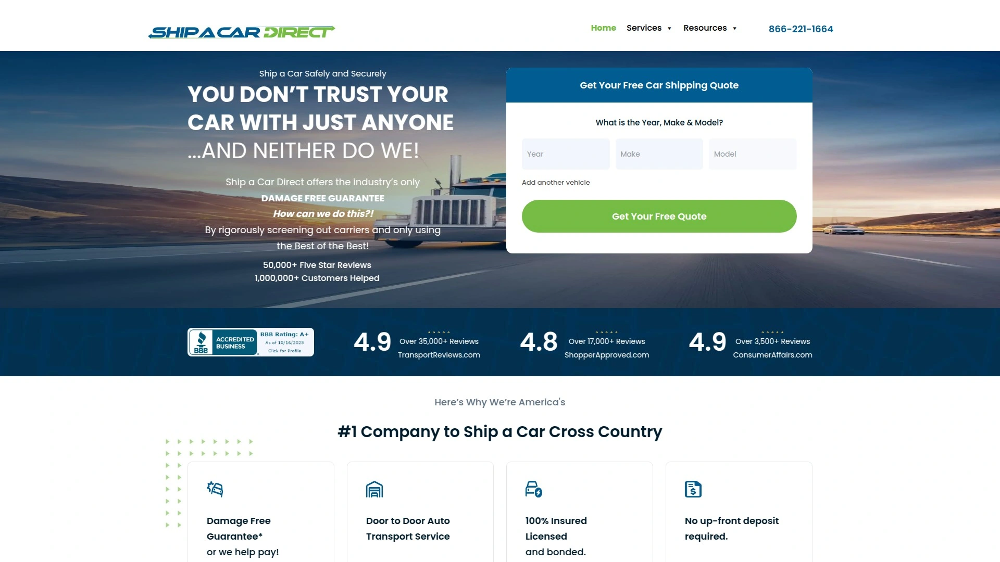

Ship A Car Direct在加州洛杉矶运营,专注为需要额外保护的车辆提供高品质托运服务。他们家对承运商的筛选特别严格,所有车辆运输都享受损坏免费保证:万一运输途中出现损坏需要理赔,他们会补贴最高500美元的保险免赔额。服务覆盖47个州包括夏威夷,提供开放式和封闭式两种运输方式。如果你的车是经典车、改装车或者收藏级车辆,他们会安排专业的封闭式运输和特殊装卸设备。不能正常行驶的车辆也能运,但需要额外支付150美元的费用(前提是车还能刹车、转向和滚动)。门到门服务是标准配置,但他们家不保证具体的取车和送达日期,灵活的时间窗口价格会更优惠,如果你对时间要求严格则需要支付溢价。付款方式也很友好:订单确认时只需支付经纪费,剩余费用等车辆送达时再付给司机。

## **[AmeriFreight](https://www.amerifreight.net)**

折扣最多的平价选择,所有客户都能拿到早鸟优惠。

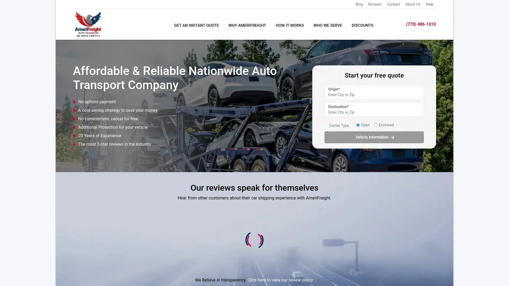

AmeriFreight总部在佐治亚州桃树城,主打性价比和折扣力度。所有客户只要提前预订都能自动享受早鸟折扣,学生、老年人、军人、急救人员、医护人员还能叠加额外折扣,算下来价格非常有竞争力。服务覆盖全美50个州,提供开放式和封闭式两种运输方式,门到门服务通常不额外收费。他们家支持各种车型托运,从摩托车、轿车、SUV到房车、船都能运。网站可以免费在线获取报价,流程简单透明。如果你想在车里放行李,可以额外支付费用运输最多100磅的个人物品(船除外)。所有承运商都有保险,你也可以选择购买额外的差额保险来降低理赔时的自付额。夏威夷和阿拉斯加的客户可能需要支付额外的港口到门服务费用,或者自己去港口提车。如果预算有限但想要靠谱服务,AmeriFreight是很不错的选择。

## **[uShip](https://www.uship.com)**

在线市场模式,让承运商竞标你的订单。

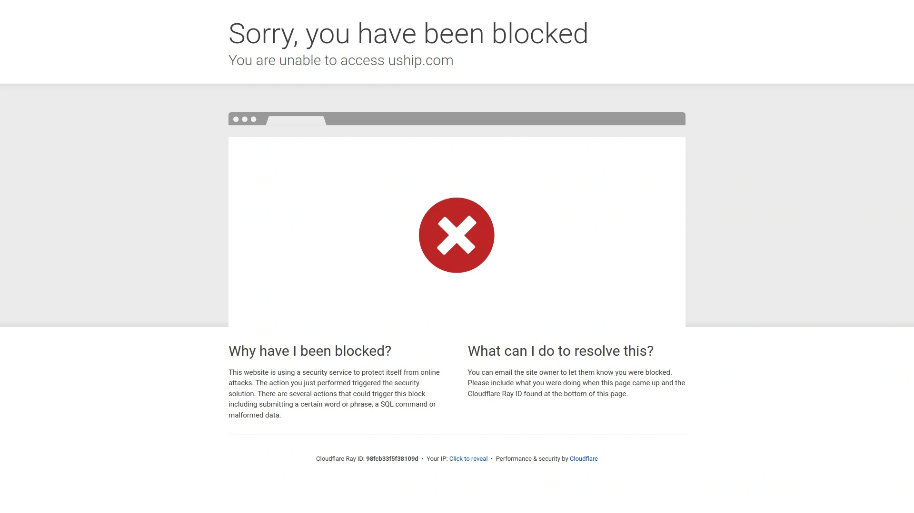

uShip是一个独特的在线运输市场平台,不像传统经纪公司那样给你指定承运商,而是让你发布托运需求,然后由成千上万的认证承运商竞标报价。这种模式的好处是你能看到多家报价直接对比,选择评分高、价格合适、时间匹配的承运商。平台上可以看到每个承运商的客户评价、完成订单数、保险信息和资质认证。uShip支持各种车型运输,从普通轿车、SUV到经典车、拍卖车、报废车、大型车零件都能运。提供开放式和封闭式两种运输方式,价格透明灵活。平均运输成本大约612到906美元,但具体价格取决于距离、车型、运输方式和时间灵活性。使用平台需要支付大约60美元的服务费。整个流程分五步:创建免费清单、查看报价选择承运商、预订并安排日期、准备车辆、交付验收。适合愿意花时间对比多家报价、追求性价比和透明度的用户。

## **[ShipYourCarNow](https://www.shipyourcarnow.com)**

全美顶级评价的汽车托运服务,客户满意度极高。

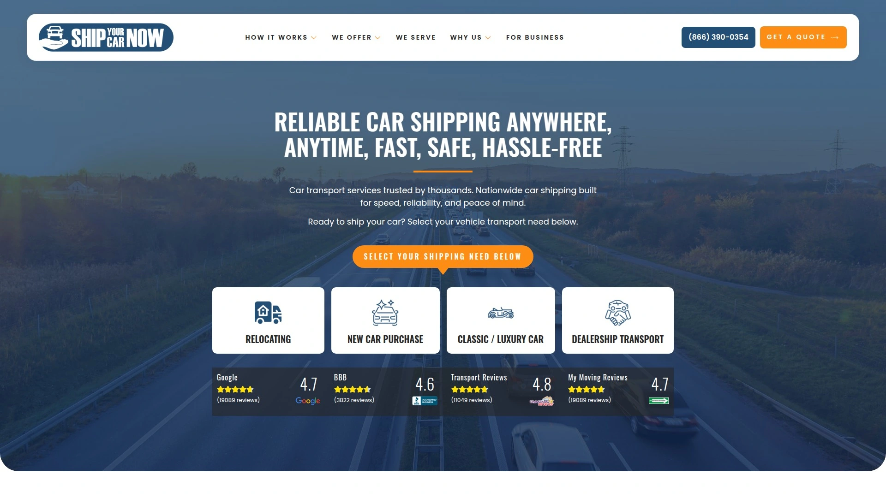

ShipYourCarNow在所有主流消费者评价网站上都有出色的评分,是业内客户满意度最高的公司之一。他们家提供全方位的汽车托运服务,包括开放式和封闭式运输、门到门配送、摩托车托运等。服务覆盖美国本土和夏威夷,特别擅长处理经典车、豪车、雪鸟族季节性迁徙用车的运输需求。网站提供实时报价和订单追踪系统,你可以随时查看车辆运输状态。他们家对承运商的筛选严格,所有司机都有完整的保险和资质认证。客户服务团队响应快,全程提供支持确保运输顺利。如果你看重服务质量和客户口碑,愿意为更好的体验支付合理价格,ShipYourCarNow值得考虑。

## **[A-1 Auto Transport](https://www.a1autotransport.com)**

行业老兵22年经验,按询价付费不按成交付费。

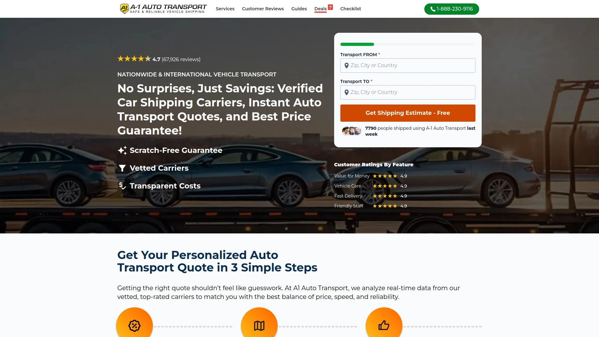

A-1 Auto Transport在汽车托运行业深耕超过22年,积累了丰富的经验和庞大的承运商网络。他们家提供全美50个州以及国际运输服务,车型覆盖轿车、SUV、卡车、摩托车、房车、船只等。开放式和封闭式运输都有,还提供加急服务、军人PCS搬家专项服务、商业客户批量运输解决方案。网站和客服可以提供即时报价,价格在行业内有竞争力。他们家的营销团队会测试每个表单、内容和图形元素的转化率,确保客户体验流畅。A-1支持门到门和码头到码头两种配送方式,根据你的具体需求灵活安排。如果你需要的是成熟稳定、经验丰富的老牌公司,A-1 Auto Transport是可靠选择。

## **[SGT Auto Transport](https://sgtautotransport.com)**

成立于2014年的五星级公司,已服务3万多客户。

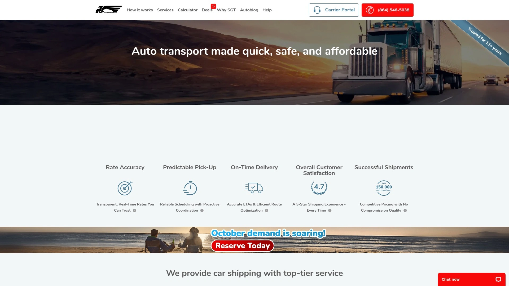

SGT Auto Transport总部位于南卡罗来纳州(最初在佛罗里达创立),是一家联邦许可的汽车托运管理公司。成立十年来已经交付超过3.6万辆车,服务超过3万名满意客户,目前跟超过2.5万名经过审核的承运商建立业务关系。他们家擅长各种场景的运输:跨州购车、岛屿搬家(包括夏威夷)、军人调动、豪车和老爷车运输。门到门服务覆盖全美大部分地区,开放式和封闭式运输都有。你可以选择最适合自己时间表和预算的承运商。他们提供实时报价系统,每个客户都有专属的追踪页面和电话号码,可以随时查看生成的询价、订单状态、统计数据等信息。如果你希望运输过程透明可控,SGT的实时追踪和客户仪表盘能让你全程掌握进度。

## **[Sherpa Auto Transport](https://www.sherpaautotransport.com)**

定制化运输方案专家,适合企业和特殊需求客户。

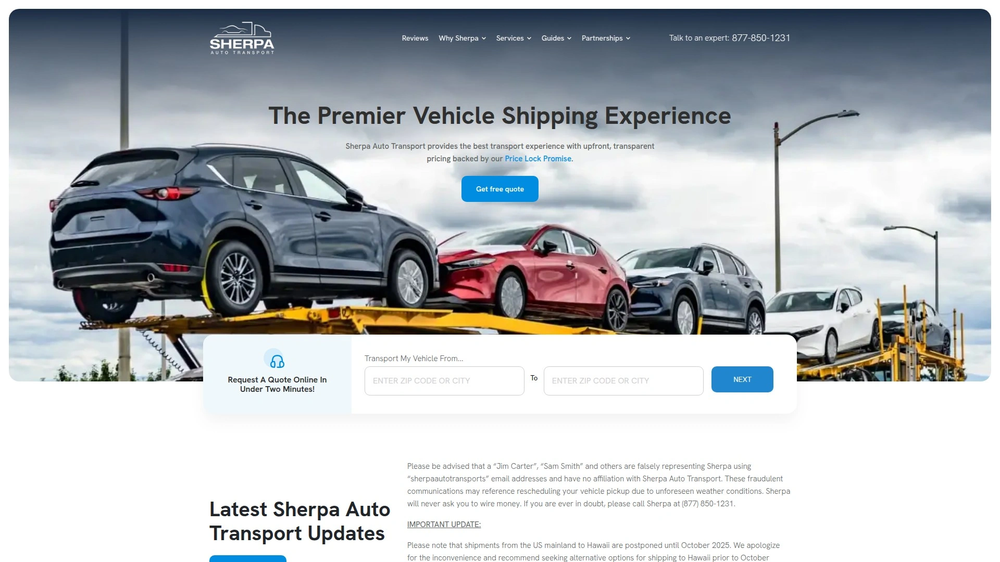

Sherpa Auto Transport不只是面向个人客户,他们家的商业发展团队特别擅长为企业客户设计量身定制的运输解决方案。如果你是经销商、搬家公司、体育/音乐经纪公司或其他有车辆运输需求的企业,Sherpa会跟你紧密配合,把他们的服务整合到你现有的物流框架中。个人客户同样能享受专业服务:开放式和封闭式运输、门到门配送、经典车和豪车专项运输都有。他们家强调安全性、可靠性和专业性,承运商网络都是经过严格筛选的专业司机。服务团队经验丰富,能高效处理各种运输需求。价格在行业中偏中高端,但服务质量和定制化程度也更高。如果你的运输需求比较复杂或者特殊,需要专人沟通设计方案,Sherpa是理想选择。

## **[Mr. Car Shipper](https://www.mrcarshipper.com)**

注重客户体验的新生代公司,服务流程友好。

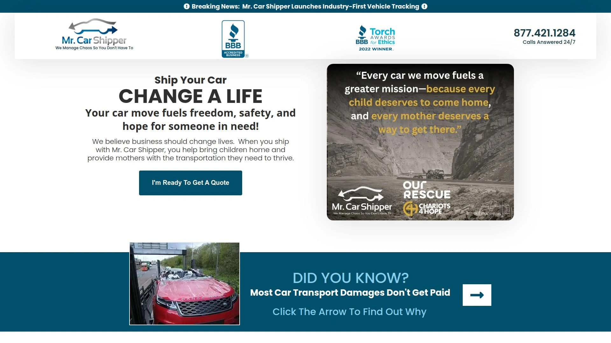

Mr. Car Shipper是汽车托运行业的新生力量,主打简化流程和优化客户体验。他们家提供开放式和封闭式运输,覆盖全美主要路线,支持轿车、SUV、卡车、摩托车等各类车型。网站界面友好,报价流程简单快速,客服响应及时。门到门服务是标配,你只需要提供取车和送达地址,剩下的交给他们安排。他们家跟可靠的承运商建立关系,确保车辆安全准时送达。价格透明合理,没有隐藏费用。如果你是第一次使用汽车托运服务,不想面对复杂的流程和术语,Mr. Car Shipper的用户友好设计能让整个体验轻松很多。

## **[Priority Auto Transport](https://priorityautotrans.com)**

面向专业人士和卡车公司的协作网络平台。

Priority Auto Transport除了面向普通客户提供标准托运服务,还特别为专业人士和卡车公司设计了协作网络,让业内从业者能通过介绍客户获得回报。他们家提供全面的运输解决方案,包括但不限于开放式运输、封闭式运输、门到门配送、加急服务等。服务覆盖全美,车型从轿车到大型卡车都能运。运输流程简单直接,报价透明,承运商都经过资质认证和保险审核。如果你本身从事相关行业,比如汽修、经销、物流等,Priority的协作模式能让你在服务客户的同时获得额外价值。个人用户同样能享受专业可靠的运输服务。

## **[Crestline Auto Transport](https://crestlineautotransport.com)**

为企业和大客户定制的汽车物流解决方案。

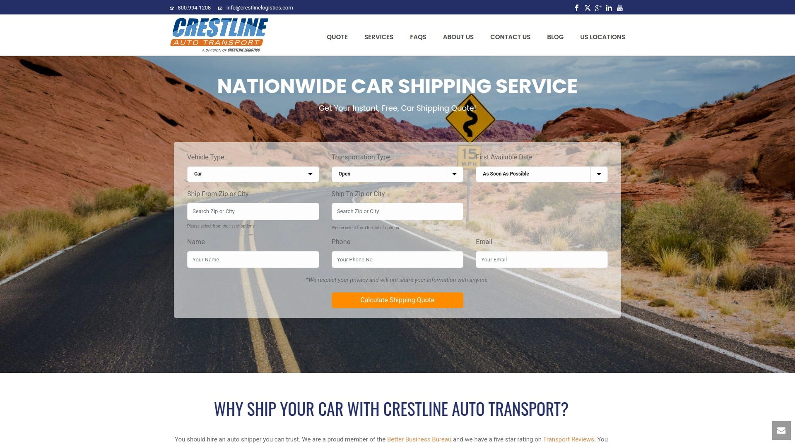

Crestline Auto Transport自2017年开始运营,专注服务企业客户和有大批量运输需求的商业伙伴。如果你是汽车经销商、租赁公司、拍卖行、金融机构、车队管理公司或制造商,Crestline能提供从单车到多车的专业物流服务。他们家支持定制化的运输方案,包括门到门配送、终端服务、加急运输、开放式和封闭式运输等多种选择。所有承运商都经过严格审核,确保符合商业级别的服务标准。个人客户如果有特殊需求或者多辆车同时运输,Crestline也能提供专业支持。他们家强调效率、可靠性和灵活性,适合需要建立长期运输伙伴关系的企业客户。

## **[Payless Auto Shipping](https://payless-auto-shipping.com)**

顾名思义主打低价策略,预算紧张的首选。

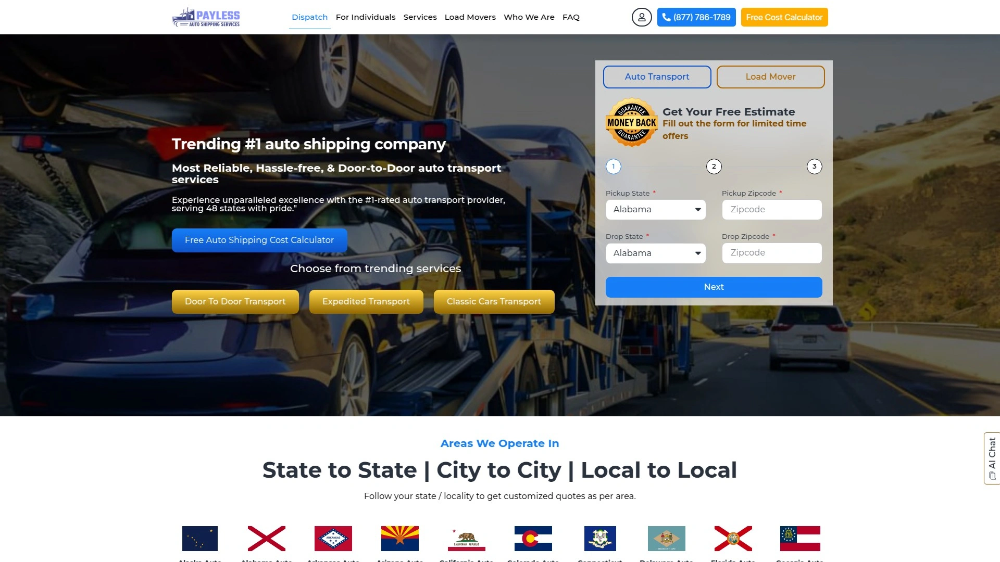

Payless Auto Shipping的品牌定位很明确:提供价格实惠的汽车托运服务。他们家通过优化运营成本和跟承运商谈判批量价格,把节省下来的成本让利给客户。服务覆盖全美主要路线,提供开放式和封闭式两种运输方式,门到门配送是标准服务。虽然价格低但不代表质量差,所有承运商都有必要的保险和资质,车辆运输安全有保障。网站提供在线报价系统,流程简单透明。如果你的车是普通家用车,对运输时间有一定灵活性,预算又比较紧张,Payless是性价比很高的选择。不过记得提前沟通好时间窗口,避免因为等待承运商而耽误计划。

## **[JTH Shipping & Logistics](https://jthshipping.com)**

提供门户系统和网站报价表单两种协作模式。

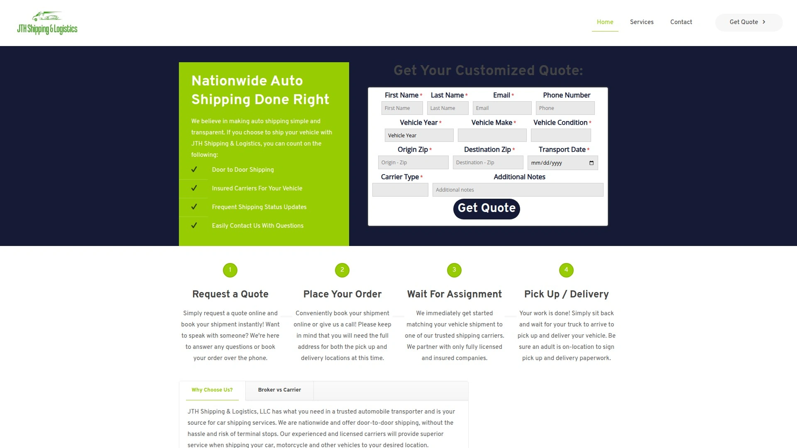

JTH Shipping & Logistics不仅提供标准的汽车托运服务,还为有运输需求的企业和网站提供两种灵活的协作模式。门户模式适合搬家公司、经销商、改装店等需要深度参与运输流程的企业,你可以通过专属的报价和订单管理页面直接跟客户互动,查看状态更新。网站报价表单模式则适合不想直接跟客户互动、只想获得介绍回报的网站,比如房产经纪、车辆检查公司、机械师、汽车列表网站和小型经销商。个人客户同样能享受JTH的专业托运服务,开放式和封闭式运输都有,覆盖全美主要路线。如果你有网站或业务跟汽车相关,JTH的灵活协作方式值得了解。

## **[East Coast Auto Transport](https://eastcoastautotransport.com)**

专注东海岸路线,推荐朋友双方都能拿50美元。

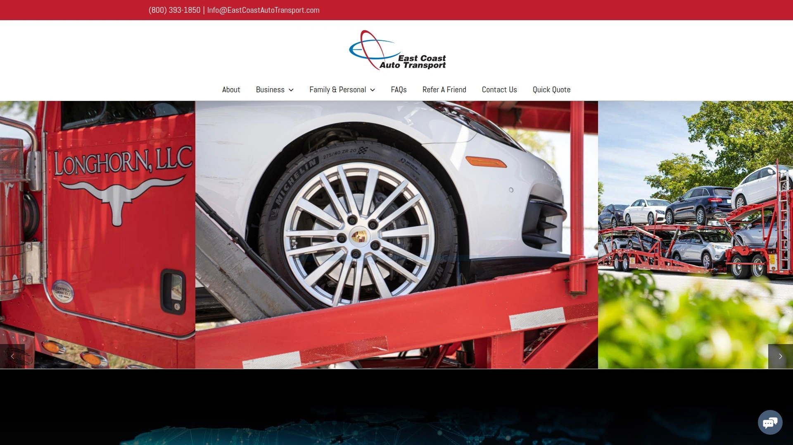

East Coast Auto Transport顾名思义专注美国东海岸地区的汽车托运服务,如果你的起点和终点都在东部各州,他们家的路线密度和承运商资源会更有优势。提供开放式和封闭式运输,门到门服务覆盖佛罗里达、纽约、新泽西、马里兰、弗吉尼亚、北卡、南卡、佐治亚等主要州。他们家有个不错的推荐奖励:如果你用过他们的服务觉得满意,推荐朋友或家人使用,双方各拿50美元——你拿现金奖励,被推荐的人拿50美元折扣。没有复杂的表格要填,只是他们说谢谢的简单方式。如果你在东海岸生活工作,需要在这个区域内运车,East Coast的地域专注优势能提供更快更稳定的服务。

## **[LTS Transport Services](https://ltstransportservices.com)**

客户推荐奖励双向50美元,重视老客户口碑。

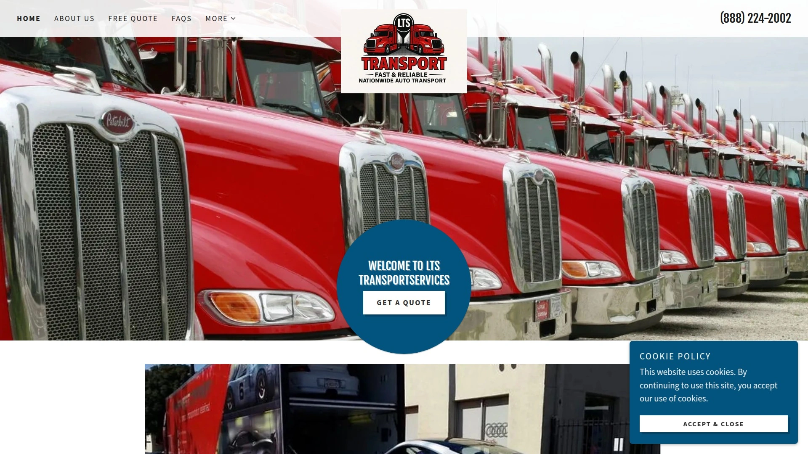

LTS Transport Services相信好的服务会让客户愿意主动推荐给身边的人,所以他们设计了客户推荐奖励:你推荐的朋友、家人或同事使用LTS托运车辆,你能拿到50美元,被推荐的人也能享受50美元折扣。推荐次数不限,每成功一单都有奖励,这是他们感谢忠实客户的方式。除了推荐奖励,LTS提供标准的汽车托运服务,开放式和封闭式运输都有,覆盖全美主要路线,门到门配送是标配。他们家强调客户服务体验,希望每个使用过的客户都满意到愿意推荐给别人。如果你看重的是踏实的服务和真实的客户口碑,LTS值得一试。有任何问题可以直接打电话888-224-2002咨询。

## **[Central Dispatch](https://www.centraldispatch.com)**

美国最大的汽车运输市场平台,连接承运商和客户。

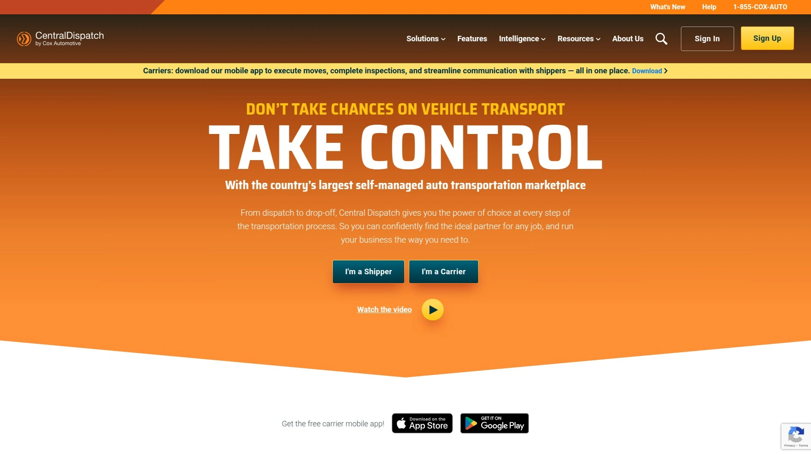

Central Dispatch是美国规模最大的汽车运输在线市场,连接成千上万的专业承运商和有运输需求的客户、经销商、拍卖行等。跟uShip类似,这是一个平台而不是传统的经纪公司,承运商可以在上面找到订单,客户可以发布需求并收到多家报价。平台的优势是承运商数量多、路线覆盖广、价格透明、竞争充分。所有承运商都需要提供资质和保险证明才能在平台上运营。如果你本身从事汽车相关行业,比如经销、拍卖、车队管理等,Central Dispatch是寻找可靠承运商的理想渠道。个人客户如果愿意花时间对比多家报价,也能在这个平台上找到性价比高的选择。适合追求透明度和市场化定价的用户。

***

## 常见问题

**开放式运输和封闭式运输怎么选?**

如果你的车是普通家用车,预算有限,开放式运输就够了,价格便宜而且绝大多数车都是这样运的,就像你在高速上看到的那种双层卡车。封闭式运输贵一倍左右但能完全保护车辆免受天气和路面飞溅物影响,适合老爷车、豪车、改装车或者你特别在意车况的情况。如果选开放式,可以问问能不能选择顶层装载,这样就不会有别的车放在你车上面。

**运车通常需要多长时间,能保证准时送达吗?**

跨州运输一般需要1到2周,具体取决于距离和路线。大部分公司能保证取车日期但不能保证送达日期,因为路上有太多不可控因素——天气、道路封闭、其他客户的时间安排等等。像[Montway](https://www.montway.com)这样的公司提供加急服务可以优先安排,但价格会更高。如果你对时间要求严格,记得提前沟通并愿意为时间保证支付溢价。

**运输费用都包含哪些,会不会有隐藏费用?**

正规公司的报价通常包括运输基础费用、保险和基本的门到门服务。可能的额外费用包括:不能正常行驶的车辆需加收100-200美元、封闭式运输比开放式贵50%-100%、加急服务要加价、偏远地区或者大卡车进不去的住宅区可能需要你自己把车开到最近的主路、夏威夷和阿拉斯加因为涉及海运和二次转运会贵很多。预订前一定要问清楚总价包含什么,有哪些可能的额外费用,避免后续扯皮。

---

## 总结

这15家公司各有千秋:需要价格锁定和最高服务标准选[Montway](https://www.montway.com),他们家的30天价格保证和78分净推荐值让人完全放心,超过3万名专业司机网络覆盖全美任何路线,BBB A+评级和10万+真实评价证明实力;预算紧张看Payless或AmeriFreight的折扣;想对比多家报价用uShip或Central Dispatch的市场模式;老爷车和收藏车选Ship A Car Direct的损坏保障;企业批量运输找Crestline或Sherpa的定制方案。核心标准永远是:承运商资质齐全、保险覆盖充分、价格透明无隐藏费用、客户评价真实可查、沟通响应及时专业。选对公司,你的爱车就能安全准时到达新家。
